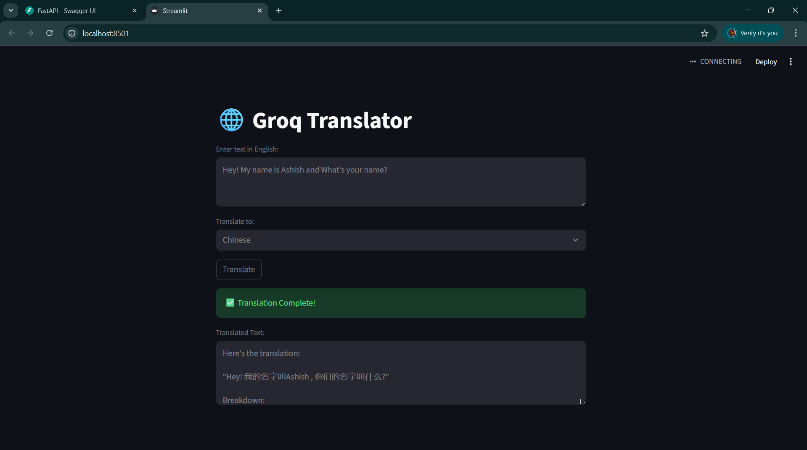

# Groq API Chatbot 🤖

A simple and extensible **AI Chatbot** built using the **Groq API** that demonstrates how to interact with large language models via an API-driven architecture.  
This project is ideal for learning how to integrate LLMs into Python applications and serves as a foundation for more advanced chatbot or AI assistant systems.

---
## 📸 Demo


## 🚀 Features

- Integration with **Groq LLM API**
- Clean and modular Python codebase
- Easy configuration using environment variables
- Beginner-friendly project structure
- Ready to extend with UI frameworks (Streamlit, Flask, etc.)

---

## 🗂️ Project Structure

```text
Groq-API-Chatbot-main/
│
├── main.py                 # FastAPI backend with Groq + LangChain
├── streamlit_app.py        # Streamlit frontend UI
├── requirements.txt        # Project dependencies
├── groq.ipynb              # Notebook for testing Groq API
├── README.md               # Project documentation
│
├── images/
│   └── image.png           # UI / project screenshots
│
└── __pycache__/
    └── main.cpython-310.pyc

```

---

## 🧠 How It Works

1. The application sends user input to the **Groq API**
2. Groq processes the prompt using a selected LLM
3. The model-generated response is returned and displayed to the user
4. The flow can be extended with memory, tools, or UI layers

---

## 🛠️ Tech Stack

- **Python**
- **Groq API**
- **LLMs (via Groq)**
- Environment variables for secure API key handling

---

## ⚙️ Installation & Setup

### 1️⃣ Clone the Repository
```bash
git clone https://github.com/your-username/Groq-API-Chatbot.git
cd Groq-API-Chatbot
```

### 2️⃣ Create Virtual Environment (Recommended)
```bash
python -m venv venv
source venv/bin/activate   # Linux / macOS
venv\Scripts\activate    # Windows
```

### 3️⃣ Install Dependencies
```bash
pip install -r requirements.txt
```

### 4️⃣ Set Environment Variables
Create a `.env` file or export directly:

```bash
GROQ_API_KEY=your_api_key_here
```

---

## ▶️ Usage

Run the chatbot application:

```bash
python main.py
```

(Replace `main.py` with the actual entry file if different.)

---

## 📌 Example Use Cases

- AI-powered chat assistant
- LLM experimentation playground
- Base template for chatbot projects
- Educational demo for API-based LLM usage

---

## 🔒 Security Notes

- **Never commit your API keys**
- Always use `.env` files or secure environment variable management

---

## 📈 Future Enhancements

- Add conversation memory
- Integrate Streamlit or Web UI
- Support multiple LLM models
- Logging and monitoring
- RAG (Retrieval-Augmented Generation) support

## 👨‍💻 Contributors
- [@ash-iiiiish](https://github.com/ash-iiiiish)

## License
This project is licensed under the MIT License. Feel free to use, modify, and distribute.
